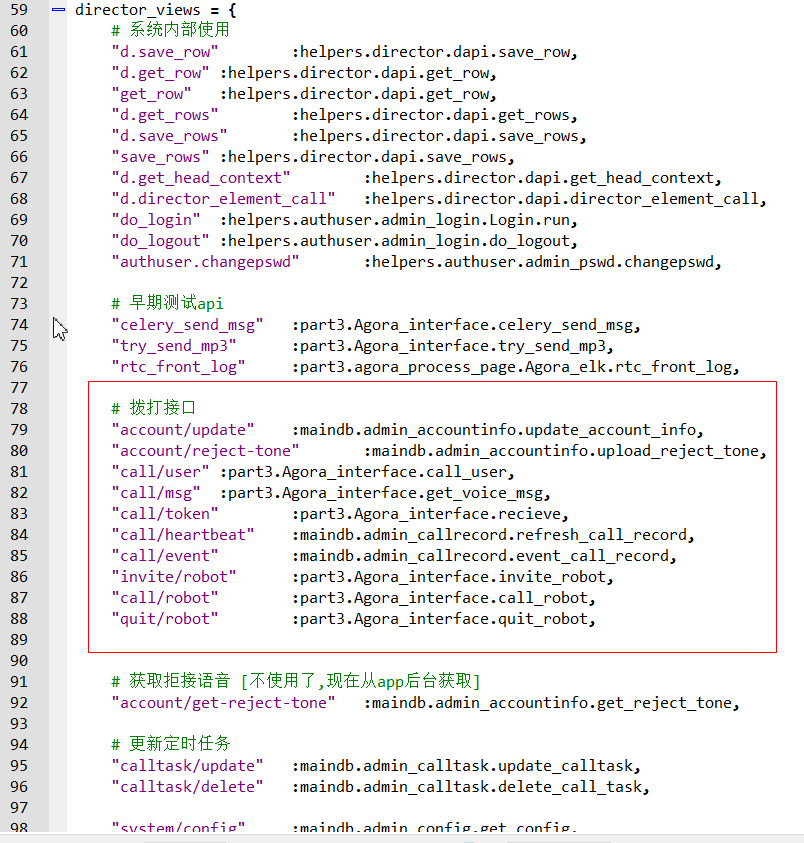
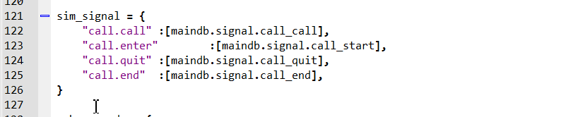

# 代码及部署

## 代码解析

所有接口的入口索引文件为:
```
src/index.py
```
该文件中有以下几个字典组成:

1. page_dc :管理后台的页面入口，所有管理页面的url形式为`{host}/pc/{key}`
2. director : 后端的一些类对象命名，便于前端直接调用。
3. director_views : 后端的接口函数。 所有的api的url形式为 `{host}/dapi/{key}`
4. sim_signal: 事件的处理函数。

针对理解系统最重要的`director_views`和`sim_signal`进行一定的说明。其他可以以此类推。

### 接口函数
所有接口函数都位于`director_views`字典中，所有的api的url形式为 `{host}/dapi/{key}`.
如下图所示，红框内的部分，即使[拨打接口](api/myapi.md)的入口函数。对于其他的接口可以以此类推找到对应的入口函数。


```eval_rst
.. _signal_code:
```
### 事件处理函数
拨打任务被分割为[4个事件](<signal_logic>)，代表了拨打任务的不同阶段。其代码入口如下图所示。



```eval_rst
.. Note:: 如果你的IDE支持，点击函数名称即可跳转到函数定义。例如pycharm,wingide这些IDE支持跳转功能。
```


## 部署方案

`拨打后台`采用python+django进行开发。后台管理界面主要使用`vue.js`进行开发。

现在开发测试环境使用 Ubuntu18.04 + Python3.6+django1.11  

管理后台界面vuejs 版本2.6.10


webserver 建议采用 nginx + uwsgi 形式

数据库建议使用 mysql5.7

测试环境消息队列:rabbitmq ,版本 3.6.10

日志系统建议采用 elk 7.1